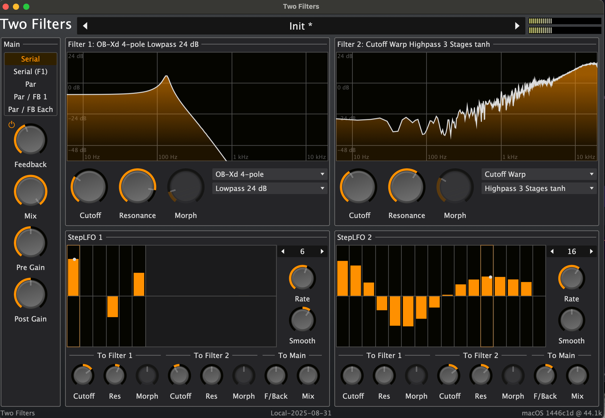

# Two Filters

Two Filers, Two Step Sequencers, and some fixed mod paths.

Really, its a test bed for our new Filter API. But you may find it fun.

Later if it is popular:
- show the modulated response in the ui also
- CLAP non-destructive modulation
