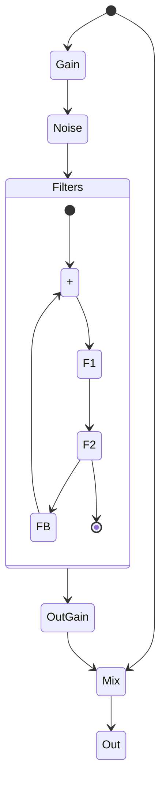
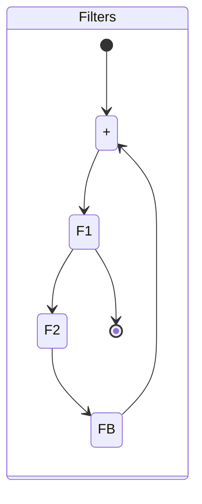
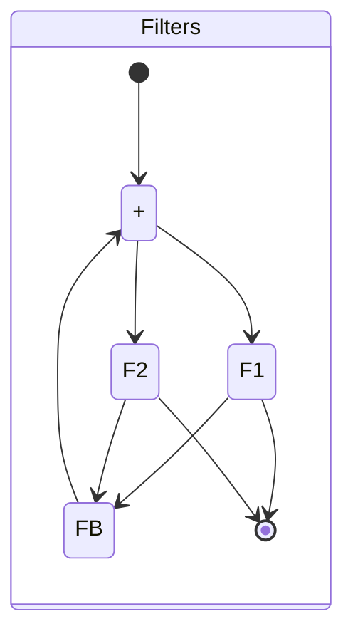
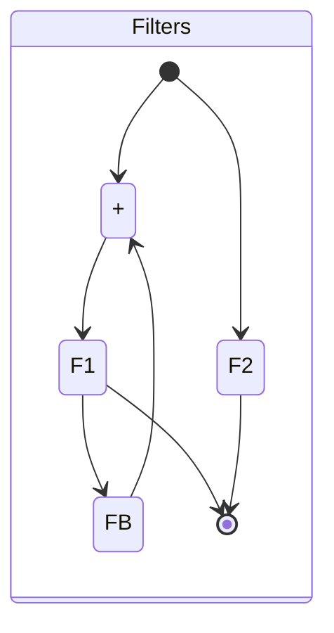
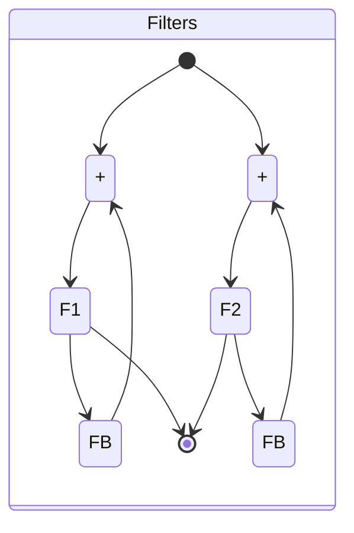

# Two Filters

This is a quick manual for Two Filters, a small plugin which exercises some of the surge
synth team libraries in a useful fashion.

## Basics

Two Filters is pretty simple. It has two filters. Each filter has a model, submodel, 
cutoff, frequency, and in some cases, a morph parameter.

It also has two step sequencers. Each step sequencer is temposynced and resets to intial
position on every measure of your DAW transport (or when transport is paused every N beats
based on your time signature).

The step sequencer can modulate the features of each filter, the overall mix, and feedback.

Finally, the plugin has a mix, pre- and post- gain, feedback, and a noise source. Both the
feedback and the noise source can be turned off for CPU optimization by the power button
next to the knob.

## The Main Menu

If you click the menu bar at the top, you can see the main menu which lets you navigate
factory patches, user patches, set preferences, load this manual, and more. 

## Routing

Two filters plus feedback can be arranged in a few ways. We provide 5 routing options.
All of them handle the combination of noise, input and output gain, and mix the same way.
Fort completeness, here is the entire Serial routing.

In Serial, F1 and F2 are in series, with a feedback loop from F2 to F1, and the output is tapped after F2

For the other routings, we just show the 'Filters' section

In Serial F1 the topology is identical to Serial but we tap output after F1

In Parallel, we run the filters in parallel with a feedback loop around both

In Parallel F1, we only run feedback around F1

Finally Parallel Each, we only run indenedent feedback around F1 and F2

